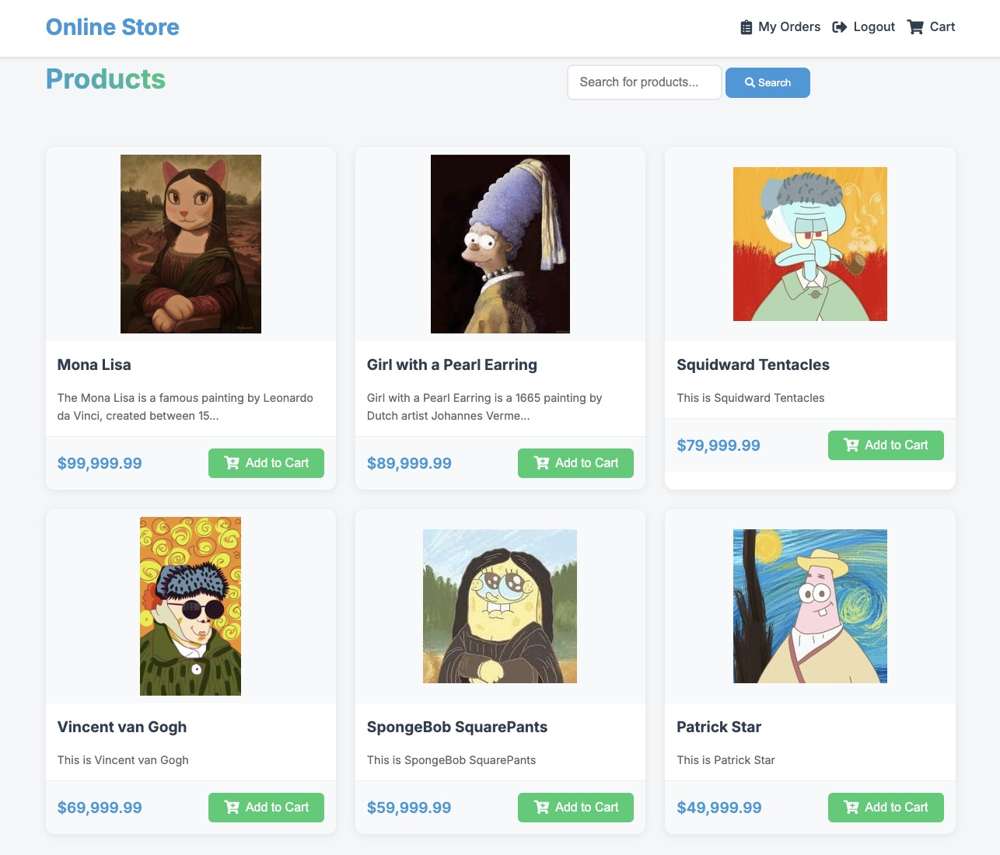

# Online Store

The administrator has the permission to view each order, and each user's order data is kept separate.

**admin:**
- username: admin
- password: admin

### How to run the application:

1. Run `bundle install` to install dependencies.
2. Start the Rails server by running `rails server`.
